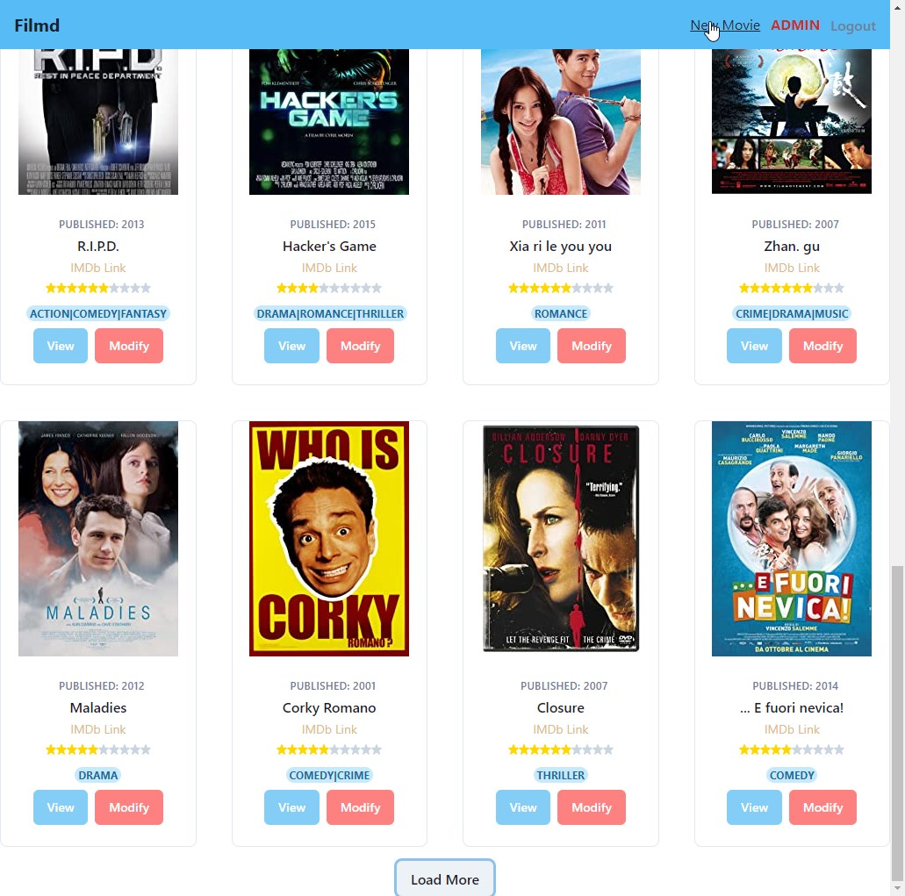
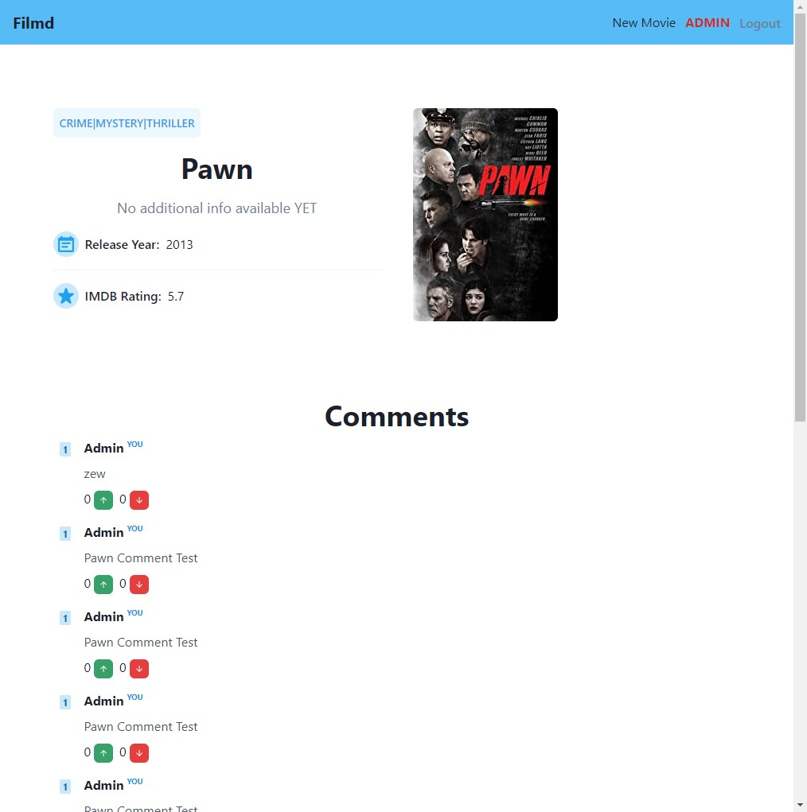

# AWAD Stack - Front (Next.js + Chakra UI)

> Front-End for https://github.com/anthocdev/awadstack

**Modifications**

- Using many other chakraUI elements
- Repurposed to a movie DB with option to comment
- Different behaviour for higher access level users (Badges/Privileges)
- Users can leave comments on movies
- Component and Method structures
- Pagination with Caching for Movies & Comments (Separated by Movie)

**Screenshots (Updated)**

